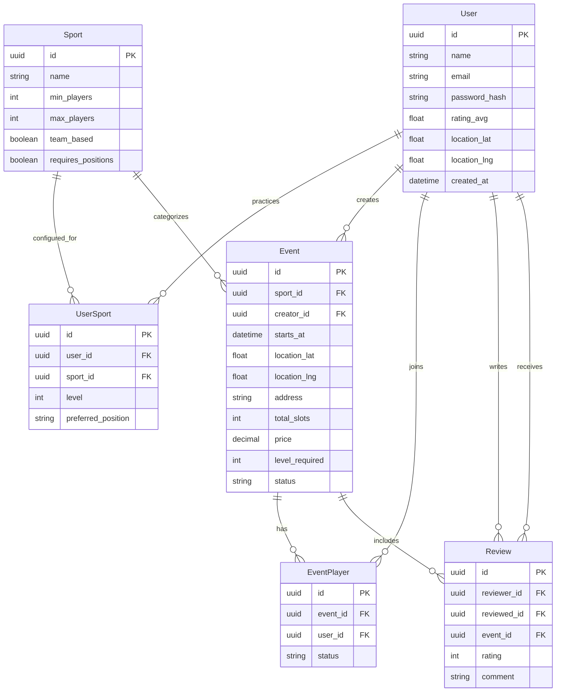

# Diagrama ER (Mermaid)

```mermaid
erDiagram
  User ||--o{ UserSport : practices
  Sport ||--o{ UserSport : configured_for
  User ||--o{ Event : creates
  Sport ||--o{ Event : categorizes
  Event ||--o{ EventPlayer : has
  User ||--o{ EventPlayer : joins
  Event ||--o{ Review : includes
  User ||--o{ Review : writes
  User ||--o{ Review : receives

  User {
    uuid id PK
    string name
    string email
    string password_hash
    float rating_avg
    float location_lat
    float location_lng
    datetime created_at
  }

  Sport {
    uuid id PK
    string name
    int min_players
    int max_players
    boolean team_based
    boolean requires_positions
  }

  UserSport {
    uuid id PK
    uuid user_id FK
    uuid sport_id FK
    int level
    string preferred_position
  }

  Event {
    uuid id PK
    uuid sport_id FK
    uuid creator_id FK
    datetime starts_at
    float location_lat
    float location_lng
    string address
    int total_slots
    decimal price
    int level_required
    string status
  }

  EventPlayer {
    uuid id PK
    uuid event_id FK
    uuid user_id FK
    string status
  }

  Review {
    uuid id PK
    uuid reviewer_id FK
    uuid reviewed_id FK
    uuid event_id FK
    int rating
    string comment
  }
```
